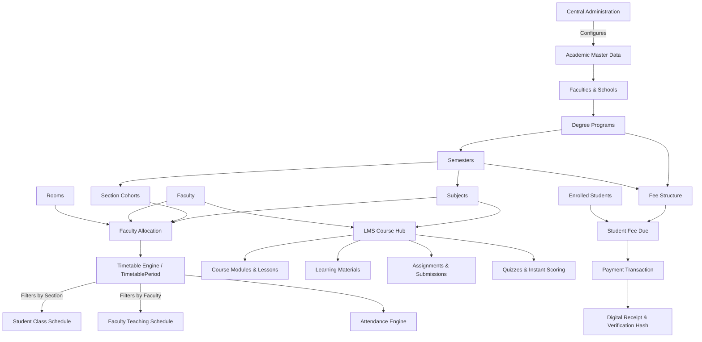
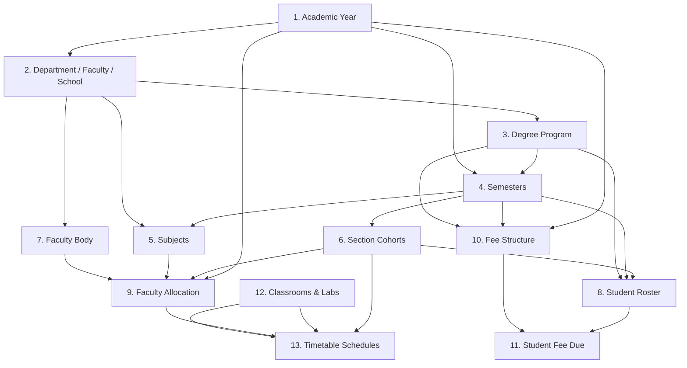
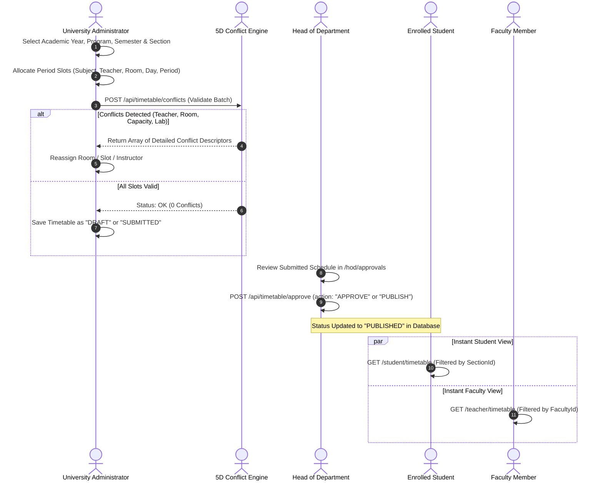
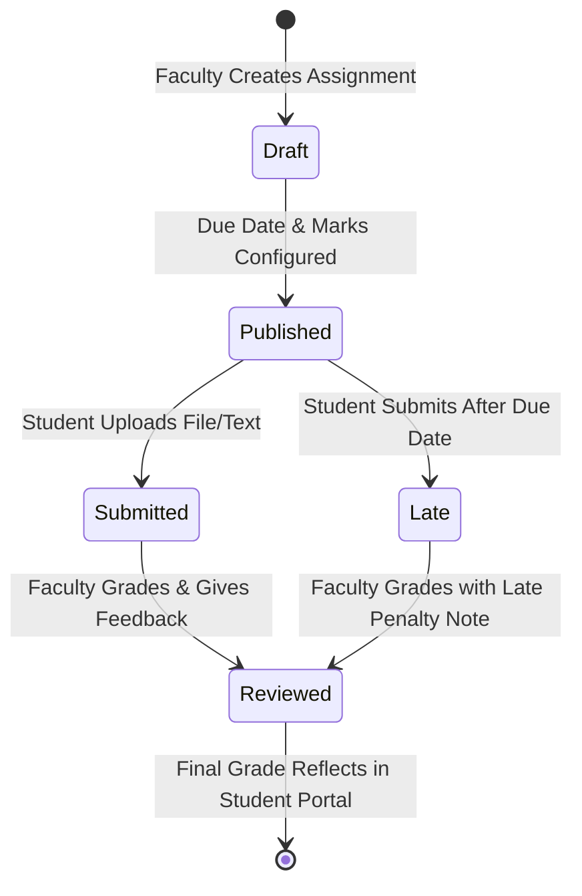
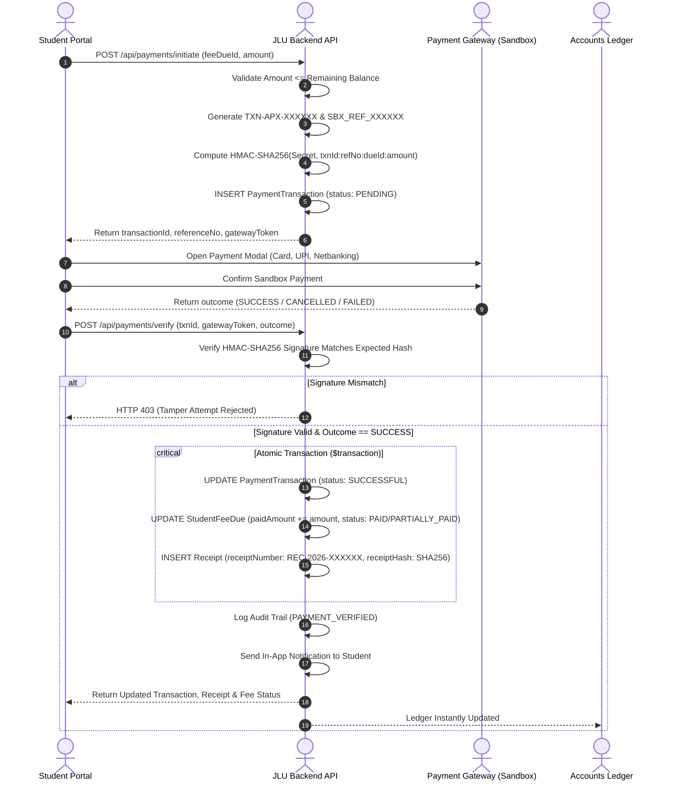
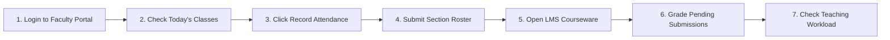
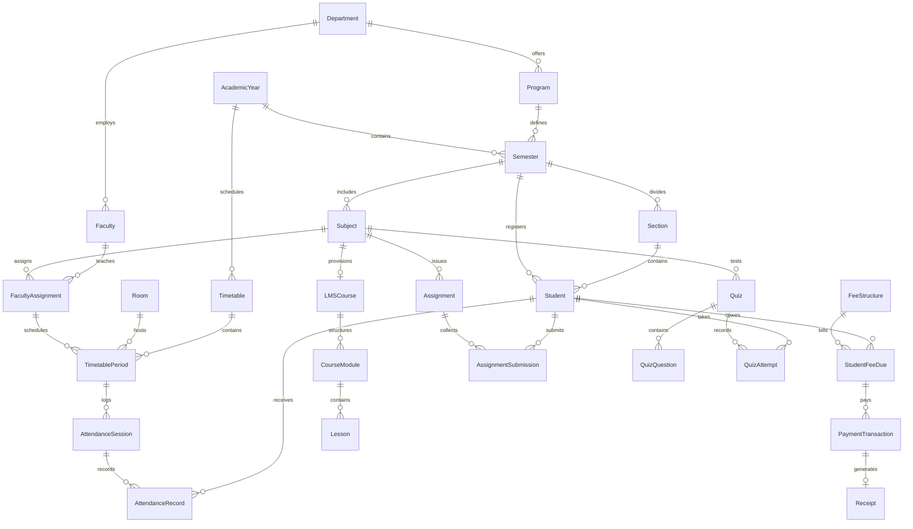

# JAGRAN LAKECITY UNIVERSITY
## JLU DIGITAL CAMPUS — UNIVERSITY ERP & LMS
### Complete User & Operations Manual

---

**Institution**: Jagran Lakecity University (JLU), Bhopal, Madhya Pradesh  
**Institutional Positioning**: *"Central India's Diamond University"*  
**System Name**: JLU Digital Campus (University ERP + LMS Integrated Platform)  
**System Version**: Release 2.4.0 (Production Stable)  
**Document Classification**: Official Institutional Operations & Technical Reference  
**Effective Date**: Academic Year 2026–2027  
**Target Audience**: Central Administration, Academic Deans, Heads of Departments (HOD), Teaching Faculty, Enrolled Students, Finance & Accounts Team, Executive Management, IT Systems & Infrastructure Staff  

---

> [!IMPORTANT]
> **Source of Truth & Architectural Foundation**:
> This manual documents the **actual implementation** of the JLU Digital Campus application. All workflows, database relations, API signatures, security mechanisms, role permissions, and screen instructions described herein correspond directly to the live codebase and schema (`prisma/schema.prisma`). No functionality has been fabricated. Features planned for subsequent release phases are explicitly labeled as **[Planned / Future Feature]**.

---

# TABLE OF CONTENTS

1. [CHAPTER 1 — ERP & LMS System Overview](#chapter-1--erp--lms-system-overview)
   - 1.1 What is the JLU Digital Campus?
   - 1.2 Core Purpose & Strategic Objectives
   - 1.3 System Scope & Integrated Modules
   - 1.4 Single Source of Truth Architecture
   - 1.5 End-to-End Interconnected Ecosystem
   - 1.6 Authentication & Session Security
2. [CHAPTER 2 — User Roles & Permissions Matrix](#chapter-2--user-roles--permissions-matrix)
   - 2.1 Role Specifications (Admin, HOD, Teacher, Student, Accounts, Management)
   - 2.2 Global Role-Based Access Control (RBAC) Matrix
   - 2.3 Role Switching & Multi-Role Governance
3. [CHAPTER 3 — System Setup & Master Data Dependency Chain](#chapter-3--system-setup--master-data-dependency-chain)
   - 3.1 The Strict Dependency Hierarchy
   - 3.2 Academic Years & Session Configuration
   - 3.3 Faculties & Schools (Department Entity)
   - 3.4 Degree Programs & Duration Pathways
   - 3.5 Semesters & Progression
   - 3.6 Subjects & Syllabus Catalog
   - 3.7 Cohort Sections
   - 3.8 Classrooms & Specialized Laboratories
   - 3.9 Faculty Profiles & Specializations
   - 3.10 Student Census & Registration
   - 3.11 Faculty Allocation to Subject & Section
4. [CHAPTER 4 — Master Timetable Management & 5D Scheduling Engine](#chapter-4--master-timetable-management--5d-scheduling-engine)
   - 4.1 The Complete Timetable Lifecycle (Step-by-Step)
   - 4.2 Single Relational Store: How Student & Teacher Timetables Stay in Sync
   - 4.3 5D Automated Conflict Detection Engine
   - 4.4 Conflict Resolution Playbook
   - 4.5 Approval & Publishing Workflow
   - 4.6 Room Allocation & Physical Capacity Management
5. [CHAPTER 5 — Attendance Management & Safety Margin Engine](#chapter-5--attendance-management--safety-margin-engine)
   - 5.1 Roster Auto-Generation & Instructor Validation
   - 5.2 Marking Daily Attendance (Present, Absent, Late, Excused)
   - 5.3 Attendance Record Immutability & Modification Protocol
   - 5.4 Student Attendance Ledger & 75% Threshold Calculations
   - 5.5 Interactive "What-If" Safety Margin Calculator
   - 5.6 HOD & Dean Oversight Cockpit
6. [CHAPTER 6 — LMS (Learning Management System) Core](#chapter-6--lms-learning-management-system-core)
   - 6.1 Native ERP-LMS Dual-Sync Architecture
   - 6.2 Auto-Provisioning of LMS Course Hubs
   - 6.3 Course Syllabus, Modules & Lessons
   - 6.4 Learning Material Repository (PDF, PPT, DOC, ZIP)
   - 6.5 Student Course Experience
7. [CHAPTER 7 — Assignments & Evaluation Workflow](#chapter-7--assignments--evaluation-workflow)
   - 7.1 Instructor Assignment Creation & Attachment Management
   - 7.2 Student Submission Protocol & Late Submission Handling
   - 7.3 Faculty Grading Queue, Score Entry & Feedback Delivery
   - 7.4 Result Reflection & Grade Book Synchronization
8. [CHAPTER 8 — Automated Quizzes & Examination Architecture](#chapter-8--automated-quizzes--examination-architecture)
   - 8.1 Quiz Configuration (MCQ, True/False, Timing, Attempts)
   - 8.2 Student Timed Attempt Engine
   - 8.3 Zero-Intervention Instant Scoring & Question Breakdown
   - 8.4 Phase 2 Examination Architecture [Planned / Future Feature]
9. [CHAPTER 9 — Fees & Sandbox Financial Transaction Engine](#chapter-9--fees--sandbox-financial-transaction-engine)
   - 9.1 Fee Structure Architecture & Semester Dues Auto-Creation
   - 9.2 Student Fee Dashboard & Payable Dues Ledger
   - 9.3 Sandbox Payment Initiation & HMAC Signature Generation
   - 9.4 Server-Side Cryptographic Signature Verification
   - 9.5 Atomic Transaction Processing & Ledger Update
   - 9.6 Digital Receipt Generation & SHA-256 Verification Hash
   - 9.7 Failure Scenarios & Edge Case Resolution
10. [CHAPTER 10 — Accounts & Bursar Operations](#chapter-10--accounts--bursar-operations)
    - 10.1 Central Financial Dashboard
    - 10.2 Fee Structure Formulation & Revision
    - 10.3 Defaulter Identification & Student Dues Tracking
    - 10.4 Gateway Reconciliation & Discrepancy Auditing
    - 10.5 Refund Management Lifecycle
11. [CHAPTER 11 — University Central Administration](#chapter-11--university-central-administration)
    - 11.1 Administration Cockpit & Daily Triage Center
    - 11.2 Master Data Administration Modules
    - 11.3 Multidisciplinary Academic Discovery (Explore Programs)
    - 11.4 System Settings & Environmental Configuration
12. [CHAPTER 12 — Head of Department (HOD) Operations](#chapter-12--head-of-department-hod-operations)
    - 12.1 Departmental Governance Cockpit
    - 12.2 Faculty Allocation Review
    - 12.3 Timetable Quality & Approval Authority
    - 12.4 Academic Performance & Attendance Monitoring
13. [CHAPTER 13 — Faculty & Teacher Operations](#chapter-13--faculty--teacher-operations)
    - 13.1 Faculty Dashboard & "A Day in the Life" Workflow
    - 13.2 Today's Classes & Instant Attendance Taking
    - 13.3 Courseware & Content Management
    - 13.4 Submission Grading & Mentorship Feedback
    - 13.5 Faculty Workload Inspector
14. [CHAPTER 14 — Student Digital Campus Experience](#chapter-14--student-digital-campus-experience)
    - 14.1 Student Dashboard: Daily Schedule & Academic Context
    - 14.2 Class Timetable & Room Directions
    - 14.3 Attendance Ledger & Warning Indicators
    - 14.4 LMS Course Participation & Submissions
    - 14.5 Fee Settlement & Official Digital Receipts
    - 14.6 Campus Life, Clubs & Flagship Events
15. [CHAPTER 15 — Management & Executive Board Analytics](#chapter-15--management--executive-board-analytics)
    - 15.1 Institutional Profile vs. Live ERP Telemetry
    - 15.2 Real-time University Enrollment & Demographic Analytics
    - 15.3 Revenue Inflow, Dues Aging & Financial Health
    - 15.4 Faculty-to-Student Ratios & Resource Utilization
    - 15.5 Global Collaborations & Industry Tie-ups Directory
16. [CHAPTER 16 — Campus Circulars & Communications](#chapter-16--campus-circulars--communications)
    - 16.1 Notice Publishing & Priority Levels
    - 16.2 Target Audience Scoping (All, Department, Program, Role)
    - 16.3 Real-time In-App Notifications
17. [CHAPTER 17 — Security, RBAC & Audit Logging Engine](#chapter-17--security-rbac--audit-logging-engine)
    - 17.1 Authentication Architecture & JWT Cookie Safeguards
    - 17.2 Immutable Audit Trail (`AuditLog` Model)
    - 17.3 IP Address & Actor Identity Recording
    - 17.4 Tamper-Proof Cryptographic Verification
18. [CHAPTER 18 — 15 End-to-End Enterprise Workflows](#chapter-18--15-end-to-end-enterprise-workflows)
19. [CHAPTER 19 — Comprehensive Frequently Asked Questions (FAQ)](#chapter-19--comprehensive-frequently-asked-questions-faq)
20. [CHAPTER 20 — System Troubleshooting & Recovery Playbook](#chapter-20--system-troubleshooting--recovery-playbook)
21. [CHAPTER 21 — Comprehensive Data Dependency & Entity Relationship Map](#chapter-21--comprehensive-data-dependency--entity-relationship-map)
22. [CHAPTER 22 — Role-Based Quick Start Reference Cards](#chapter-22--role-based-quick-start-reference-cards)
23. [CHAPTER 23 — Institutional Terminology & System Glossary](#chapter-23--institutional-terminology--system-glossary)
24. [CHAPTER 24 — Technical & IT Administration Appendix](#chapter-24--technical--it-administration-appendix)

---

# CHAPTER 1 — ERP & LMS SYSTEM OVERVIEW

### 1.1 What is the JLU Digital Campus?
The **JLU Digital Campus** is the unified enterprise resource planning (ERP) and learning management platform built specifically for **Jagran Lakecity University (JLU), Bhopal, Madhya Pradesh** (*"Central India's Diamond University"*). It serves as the single digital operating system for academic administration, faculty workload, student life, attendance registers, classroom allocation, LMS delivery, financial dues, and institutional reporting.

### 1.2 Core Purpose & Strategic Objectives
1. **Eliminate Administrative Fragmentation**: Replace disjointed spreadsheets, paper registers, and separate LMS tools with one central relational database.
2. **Enforce Single Data Entry**: Information entered once (e.g. course code, room assignment, faculty allocation) instantly synchronizes across timetables, student portals, teacher schedules, attendance rosters, and LMS courses.
3. **Automate Operational Integrity**: Real-time validation engines prevent classroom double-bookings, teacher scheduling overlaps, and unauthorized grade alterations.
4. **Deliver Institutional Transparency**: Maintain an unalterable audit trail of every academic, financial, and administrative action taken across the campus.

### 1.3 System Scope & Integrated Modules
The application incorporates 80 synchronized routes covering 6 operational pillars:
- **Academic Master Data**: Faculties/Schools, Programs (UG/PG/Ph.D.), Semesters, Subjects, Sections, Classrooms, and Laboratories.
- **Scheduling & Timetable Engine**: Weekly timetable builder with 5D conflict inspection and multi-role views.
- **Attendance System**: Live section roster generation, period-based marking, threshold calculators, and safety margin analysis.
- **LMS (JLU Learning)**: Course syllabus structuring, module-lesson hierarchies, cloud learning resources, assignment grading queues, and automated quiz evaluation.
- **Treasury & Fee Management**: Fee structure templates, auto-generated student dues, sandbox payment gateway with HMAC verification, digital receipts, and bank reconciliation.
- **Audit & Governance**: Centralized audit logging, campus circulars, global command palette (`⌘K`), and executive analytics.

### 1.4 Single Source of Truth Architecture
In the JLU Digital Campus, data redundancy is architecturally prohibited. The relational diagram below illustrates how every operational module branches from the central academic master data:



### 1.5 End-to-End Interconnected Ecosystem
- When an Administrator assigns Dr. Vikram Rao to *Database Management Systems (CS301)* for *Section A* on Monday Period 1 in *Room LH-101*:
  1. The entry is recorded in `TimetablePeriod`.
  2. Section A students instantly see this lecture in their **Weekly Class Timetable** and **Student Dashboard**.
  3. Dr. Vikram Rao instantly sees this lecture in his **Teaching Timetable** and **Today's Classes**.
  4. Room *LH-101* is locked for Monday 09:00–10:00, preventing any other department from scheduling it.
  5. The teacher can click `[Record Attendance]` directly from that schedule card, which auto-loads Section A's enrolled students.
  6. The LMS course *Database Management Systems* links Dr. Rao's lecture notes and assignments directly to Section A.

### 1.6 Authentication & Session Security
- **Authentication**: JWT-based session architecture using an HTTP-only, `SameSite=Lax` cookie named `univ_session`.
- **Default Lifespan**: 7 days with automatic session token signature verification.
- **Password Security**: Salted Bcrypt hashing (`bcryptjs` with 10 salt rounds).
- **Session Verification**: On every request, `getCurrentUser()` reads `univ_session`, decodes the payload, and validates that the user account exists and has `isActive === true` in the SQLite/PostgreSQL database.

---

# CHAPTER 2 — USER ROLES & PERMISSIONS MATRIX

### 2.1 Role Specifications

#### A. Central Administration (`ADMIN`)
- **Institutional Role**: Central Registrar's Office, Academic Affairs, and ERP System Administrators.
- **Primary Route**: `/admin/dashboard`
- **Responsibilities**: Configure faculties, schools, programs, semesters, subjects, sections, rooms, faculty body, student enrollment, fee structures, university notices, timetable creation, and system settings.
- **Access Limits**: Cannot modify student payment hashes once finalized; cannot impersonate student quiz attempts.

#### B. Head of Department (`HOD`)
- **Institutional Role**: Deans of Faculties, Directors of Schools, Department Heads (e.g. Jagran School of Engineering).
- **Primary Route**: `/hod/dashboard`
- **Responsibilities**: Oversee department faculty roster, track student enrollment within the department, review teaching workloads, approve or publish master timetables, and monitor attendance health across sections.
- **Access Limits**: Scoped strictly to their assigned `departmentId`. Cannot alter fee structures or university master settings.

#### C. Teaching Faculty (`TEACHER`)
- **Institutional Role**: Professors, Associate Professors, Assistant Professors, and Lab Instructors.
- **Primary Route**: `/teacher/dashboard`
- **Responsibilities**: View personal weekly teaching timetable, conduct lectures, mark attendance registers for assigned sections, upload learning materials to LMS courses, issue assignments, evaluate submissions, and publish academic announcements.
- **Access Limits**: Cannot mark attendance for sections they are not allocated to; cannot alter subject credits or semester definitions.

#### D. Enrolled Student (`STUDENT`)
- **Institutional Role**: Undergraduate, Postgraduate, and Doctoral candidates across JLU schools.
- **Primary Route**: `/student/dashboard`
- **Responsibilities**: Track today's lectures, view academic schedule, monitor personal attendance percentages and safety margins, access LMS courseware, submit assignments, take online quizzes, pay tuition fees, download official receipts, and engage in campus life.
- **Access Limits**: Read-only access to master data; cannot view peer grades, faculty rosters, or unpublished timetable drafts.

#### E. Accounts & Bursar (`ACCOUNTS`)
- **Institutional Role**: University Finance Office, Comptroller, and Bursar Staff.
- **Primary Route**: `/accounts/dashboard`
- **Responsibilities**: Formulate semester fee structures, track student dues, audit live payment transactions, perform bank reconciliation, issue digital receipts, process approved refunds, and generate collection reports.
- **Access Limits**: Cannot alter academic timetable schedules, student grades, or faculty allocations.

#### F. Executive Management (`MANAGEMENT`)
- **Institutional Role**: Chancellor, Pro-Chancellor, Vice-Chancellor, Registrar, Board of Governors.
- **Primary Route**: `/management/dashboard`
- **Responsibilities**: Strategic governance, macro enrollment analytics, faculty-to-student ratios, revenue inflow monitoring, outstanding fee exposure, academic performance trends, and international partnership reporting.
- **Access Limits**: Executive analytical view; operational forms (adding rooms, marking attendance) are restricted to operational roles.

---

### 2.2 Global Role-Based Access Control (RBAC) Matrix

| Operational Module / Capability | ADMIN | HOD | TEACHER | STUDENT | ACCOUNTS | MANAGEMENT |
|---|:---:|:---:|:---:|:---:|:---:|:---:|
| **Manage Faculties & Schools** | Full | View Dept | View Dept | — | — | View All |
| **Create Degree Programs** | Full | View Dept | — | View Public | — | View All |
| **Manage Subjects & Syllabus** | Full | Edit Dept | View | View | — | View All |
| **Create Section Cohorts** | Full | View Dept | View | View Own | — | View All |
| **Configure Classrooms & Labs** | Full | View | View | — | — | View All |
| **Enroll Students / Profiles** | Full | View Dept | View Class | View Own | View Dues | View All |
| **Create Faculty Accounts** | Full | View Dept | — | — | — | View All |
| **Allocate Faculty to Subject** | Full | Full Dept | View Own | View Class | — | View All |
| **Build Timetable Schedules** | Full | Review | View Own | View Own | — | View All |
| **Run Conflict Inspector** | Full | Full Dept | — | — | — | View All |
| **Approve / Publish Timetable** | Full | Full Dept | — | — | — | — |
| **Record Attendance Register** | Full | Review | Assigned | — | — | View All |
| **View Personal Attendance** | Full | Dept Roster | Class Roster | View Own | — | View All |
| **Author LMS Courseware** | Full | Edit Dept | Assigned | View Enrolled | — | View All |
| **Create Assignments** | Full | Review | Assigned | — | — | View All |
| **Submit Assignment Files** | — | — | — | Enrolled | — | — |
| **Grade Submissions** | Full | Review | Assigned | View Own | — | View All |
| **Create & Deploy Quizzes** | Full | Review | Assigned | — | — | View All |
| **Attempt Online Quizzes** | — | — | — | Enrolled | — | — |
| **Configure Fee Structures** | Full | — | — | — | Full | View All |
| **Initiate Fee Payment** | Full | — | — | View Own | Full | — |
| **Verify Transactions (HMAC)** | System | — | — | — | System | View All |
| **Download Digital Receipts** | Full | — | — | View Own | Full | View All |
| **Process Fee Refunds** | Full | — | — | — | Full | View All |
| **Publish Campus Circulars** | Full | Full Dept | Full Class | View Scoped | Full | Full |
| **Audit Log Inspection** | Full | — | — | — | Financial | View All |
| **Role Switcher (Dev Mode)** | Available | Available | Available | Available | Available | Available |

---

# CHAPTER 3 — SYSTEM SETUP & MASTER DATA DEPENDENCY CHAIN

### 3.1 The Strict Dependency Hierarchy
Master data must be entered in exact sequential order. Attempting to create records out of sequence will result in database foreign key constraint errors (`Foreign key constraint failed`).



---

### 3.2 Academic Years & Session Configuration
- **Entity**: `AcademicYear`
- **Purpose**: Defines the operational academic cycle (e.g. *2026-2027*). Controls active semesters, fee structures, enrollments, and timetables.
- **Required Fields**: `name` (unique string, e.g. "2026-2027"), `startDate` (DateTime), `endDate` (DateTime), `isCurrent` (Boolean).
- **Impact if Incorrect**: Timetable generators and fee structures will attach to historical periods; student portals will display empty terms.

---

### 3.3 Faculties & Schools (Department Entity)
- **Entity**: `Department`
- **Purpose**: Represents JLU’s academic divisions (e.g. *Faculty of Science & Technology*, *Jagran School of Engineering*, *Jagran Lakecity Business School*).
- **Navigation**: `/admin/departments`
- **API**: `POST /api/admin/departments`
- **Required Fields**:
  - `code`: Unique short uppercase identifier (e.g., `ENGG`, `CS`, `MGMT`, `LAW`).
  - `name`: Full official nomenclature (e.g., "Jagran School of Engineering").
  - `building`: Physical campus wing (e.g., "Block A - Engineering Wing").
  - `description`: Scope of multidisciplinary study.
- **Backend Behavior**: Generates a record in `Department` and writes an entry to `AuditLog` (`DEPARTMENT_CREATE`).

---

### 3.4 Degree Programs & Duration Pathways
- **Entity**: `Program`
- **Navigation**: `/admin/programs`
- **API**: `POST /api/admin/programs`
- **Required Fields**:
  - `code`: Unique code (e.g., `BTECH_CSE`, `MBA_EXEC`, `BALLB_HONS`).
  - `name`: Full degree title (e.g., "Bachelor of Technology in Computer Science & Engineering").
  - `degreeType`: `UNDERGRADUATE` | `POSTGRADUATE` | `DIPLOMA`.
  - `durationYears`: Integer (e.g., `4` for B.Tech, `2` for MBA, `5` for Integrated Law).
  - `departmentId`: Relational link to the parent School.
- **Automated Cascade**: The backend automatically provisions `durationYears * 2` semesters linked to the active `AcademicYear`. For a 4-year B.Tech program, Semesters 1 through 8 are auto-created instantly.

---

### 3.5 Semesters & Progression
- **Entity**: `Semester`
- **Fields**: `number` (Int 1–10), `programId`, `academicYearId`, `isActive` (Boolean).
- **Dependencies**: Parent Program and active Academic Year.
- **Role in System**: Serves as the junction entity for Subjects, Sections, Student Cohorts, Fee Structures, and Timetables.

---

### 3.6 Subjects & Syllabus Catalog
- **Entity**: `Subject`
- **Navigation**: `/admin/subjects`
- **API**: `POST /api/admin/subjects`
- **Required Fields**:
  - `code`: Unique academic code (e.g., `CS301`, `MGMT502`, `LAW101`).
  - `name`: Subject title (e.g., "Database Management Systems").
  - `credits`: Numerical credit value (e.g., `4`).
  - `type`: `THEORY` | `LAB` | `HYBRID`.
  - `semesterId`: Relational link to target semester.
  - `departmentId`: Relational link to administering faculty.
- **Automated LMS Provisioning**: When a subject is saved, the backend automatically locates a faculty member in that department and provisions an `LMSCourse` container ready for modules and lesson materials.

---

### 3.7 Cohort Sections
- **Entity**: `Section`
- **Navigation**: `/admin/sections`
- **API**: `POST /api/admin/sections`
- **Required Fields**: `name` (e.g., "Section A", "Section B"), `capacity` (Integer, default `60`), `semesterId`.
- **System Impact**: Defines the student group. Timetables, attendance sessions, and class rosters are tied directly to this entity.

---

### 3.8 Classrooms & Specialized Laboratories
- **Entity**: `Room`
- **Navigation**: `/admin/rooms`
- **API**: `POST /api/admin/rooms`
- **Required Fields**:
  - `roomNumber`: Unique classroom number (e.g., `LH-101`, `LAB-2`, `AUD-1`).
  - `building`: Campus building name (e.g., "Block A", "Media Centre").
  - `floor`: Integer (e.g., `1`, `2`, `3`).
  - `capacity`: Maximum seating capacity (e.g., `60`).
  - `roomType`: `CLASSROOM` | `LAB` | `SEMINAR_HALL`.
- **Engine Enforcement**: Used by the 5D Timetable Engine to block concurrent room occupancy and verify laboratory equipment requirements.

---

### 3.9 Faculty Profiles & Specializations
- **Entities**: `User` + `Faculty`
- **Navigation**: `/admin/faculty`
- **API**: `POST /api/admin/faculty`
- **Required Fields**:
  - `name`: Professor's full title & name.
  - `email`: Official email (e.g., `vikram.rao@jlu.edu.in`).
  - `employeeCode`: Unique employee ID (e.g., `FAC-CS-01`).
  - `departmentId`: Faculty/School affiliation.
  - `designation`: e.g. "Professor", "Associate Professor", "HOD".
  - `qualification`: e.g. "Ph.D. in Computer Engineering".
  - `specialization`: e.g. "Relational Databases, Distributed Systems".
- **Backend Provisioning**: Automatically hashes password (`password123`), assigns role `TEACHER`, creates relational `Faculty` profile, and logs the audit event.

---

### 3.10 Student Census & Registration
- **Entities**: `User` + `Student`
- **Navigation**: `/admin/students`
- **API**: `POST /api/admin/students`
- **Required Fields**: `name`, `email`, `rollNumber` (e.g. `26CS0101`), `programId`, `sectionId` (optional, can be assigned later), `gender`, `guardianName`.
- **Automated Onboarding Sequence**:
  1. Creates `User` account with role `STUDENT`.
  2. Generates unique permanent registration code `JLU-REG-XXXXXX`.
  3. Links student to Semester 1 of the chosen Program.
  4. **Financial Cascade**: Looks up the active `FeeStructure` for that Program and Semester; if found, automatically creates a `StudentFeeDue` record of status `PENDING`.

---

### 3.11 Faculty Allocation to Subject & Section
- **Entity**: `FacultyAssignment`
- **Navigation**: `/admin/faculty-allocation`
- **Composite Unique Key**: `[facultyId, subjectId, sectionId, academicYearId]`
- **Purpose**: Authorizes a teacher to conduct classes, mark attendance, and manage grades for a specific student section. Without this record, a teacher cannot mark attendance for that group.

---

# CHAPTER 4 — MASTER TIMETABLE MANAGEMENT & 5D SCHEDULING ENGINE

```
========================================================================================
                          JLU MASTER TIMETABLE ARCHITECTURE
========================================================================================
```

### 4.1 The Complete Timetable Lifecycle (Step-by-Step)



---

### 4.2 Single Relational Store: How Student & Teacher Timetables Stay in Sync

#### QUESTION: Does the university manually create separate timetables for students and teachers?
**ANSWER**: **NO.** The application stores scheduled periods in a single unified table: `TimetablePeriod`.

Each period record contains:
- `subjectId` (Which subject is taught)
- `sectionId` (Which group of students attends)
- `facultyId` (Which teacher conducts the lecture)
- `roomId` (Which room or lab is occupied)
- `dayOfWeek` (MONDAY through SATURDAY)
- `periodNumber` (1 through 8)
- `startTime` & `endTime` (e.g. "09:00" to "10:00")
- `timetableId` (Pointer to parent master schedule)

#### How the Views Are Generated:
- **Student Timetable View (`/student/timetable`)**:
  ```ts
  // Code in app/(dashboard)/student/timetable/page.tsx
  const periods = await prisma.timetablePeriod.findMany({
    where: {
      sectionId: student.sectionId,
      timetable: { status: "PUBLISHED" },
    },
    include: { subject: true, faculty: { include: { user: true } }, room: true },
  });
  ```
- **Teacher Timetable View (`/teacher/timetable`)**:
  ```ts
  // Code in app/(dashboard)/teacher/timetable/page.tsx
  const periods = await prisma.timetablePeriod.findMany({
    where: {
      facultyId: user.facultyId,
      timetable: { status: "PUBLISHED" },
    },
    include: { subject: true, section: true, room: true },
  });
  ```
**Result**: There is zero duplicate data entry. Modifying a period in the master timetable instantly updates both the student's schedule and the teacher's schedule.

---

### 4.3 5D Automated Conflict Detection Engine
Located in `lib/timetable-engine.ts`, the `detectTimetableConflicts()` function runs a rigorous 5-dimensional audit:

```
+-----------------------------------------------------------------------------------+
|                        5D CONFLICT DETECTION MATRIX                               |
+----+----------------------------+----------+--------------------------------------+
| #  | Conflict Dimension         | Severity | Rule Description                     |
+----+----------------------------+----------+--------------------------------------+
| 1  | TEACHER COLLISION          | ERROR    | Same faculty member assigned to two  |
|    |                            |          | different classes in the same period |
| 2  | ROOM DOUBLE-BOOKING        | ERROR    | Same classroom or lab booked for two |
|    |                            |          | different classes in the same period |
| 3  | SECTION OVERLAP            | ERROR    | Same student section assigned to two |
|    |                            |          | lectures in the same period          |
| 4  | CAPACITY DEFICIT           | WARNING  | Room capacity is smaller than the    |
|    |                            |          | enrolled section cohort capacity     |
| 5  | LAB REQUIREMENT MISMATCH   | ERROR    | Practical/Lab subject scheduled in   |
|    |                            |          | a theoretical classroom              |
+----+----------------------------+----------+--------------------------------------+
```

#### Dual-Scope Inspection:
1. **Internal Batch Inspection**: Compares proposed slots against other slots in the current draft to detect internal duplicate bookings.
2. **External University-Wide Inspection**: Compares proposed slots against all other `APPROVED` and `PUBLISHED` timetables across all other schools in JLU to ensure rooms and shared faculty are not double-booked.

---

### 4.4 Conflict Resolution Playbook
When `POST /api/timetable/conflicts` returns `hasConflicts: true`:
1. **Teacher Conflict**: Identify which teacher has overlapping periods. Use the Faculty Allocation directory to substitute an alternate co-faculty or shift the period number.
2. **Room Conflict**: Click on the conflict card to inspect which other department occupies the room. Select an alternate available room in the same building.
3. **Capacity Warning**: If Section A has 60 students and Room 104 seats only 45, reassign the lecture to a lecture hall (e.g. *LH-101*, capacity 80).
4. **Lab Requirement Error**: If *Database Management Systems Lab* is assigned to *Classroom 201*, the engine flags a fatal error. Reassign to a designated room where `roomType === "LAB"`.

---

### 4.5 Approval & Publishing Workflow
1. Admin finalizes draft schedule (`status: "SUBMITTED"`).
2. HOD opens `/hod/approvals`.
3. HOD verifies workload balance and room assignments.
4. HOD clicks `[Approve & Publish]`.
5. API updates status to `PUBLISHED`, sets `publishedAt = now()`, and creates an immutable `AuditLog` entry (`TIMETABLE_PUBLISHED`).

---

# CHAPTER 5 — ATTENDANCE MANAGEMENT & SAFETY MARGIN ENGINE

```
========================================================================================
                         JLU ATTENDANCE OPERATIONAL WORKFLOW
========================================================================================
```

### 5.1 Roster Auto-Generation & Instructor Validation
When a teacher navigates to `/teacher/attendance`:
1. The screen queries the teacher's active assignments from `FacultyAssignment`.
2. The teacher selects Subject, Section, and Date.
3. The interface calls `GET /api/attendance/roster?sectionId={sectionId}`.
4. The backend queries `Student` where `sectionId === sectionId` ordered by `rollNumber asc`, returning student names, roll numbers, and avatars.

---

### 5.2 Marking Daily Attendance
- **API Endpoint**: `POST /api/attendance/mark`
- **Payload Format**:
  ```json
  {
    "timetablePeriodId": "uuid-optional",
    "subjectId": "uuid-subject",
    "sectionId": "uuid-section",
    "date": "2026-09-07T00:00:00.000Z",
    "periodNumber": 1,
    "records": [
      { "studentId": "uuid-1", "status": "PRESENT", "remarks": null },
      { "studentId": "uuid-2", "status": "ABSENT", "remarks": "Unexcused" },
      { "studentId": "uuid-3", "status": "LATE", "remarks": "Arrived 15m late" },
      { "studentId": "uuid-4", "status": "EXCUSED", "remarks": "Medical leave" }
    ]
  }
  ```

#### Backend Database Execution:
1. Verifies that the logged-in user is authorized to mark attendance for this subject/section.
2. Upserts `AttendanceSession` on unique composite key `[subjectId, sectionId, date, periodNumber]`.
3. Upserts individual `AttendanceRecord` rows on composite key `[attendanceSessionId, studentId]`.
4. Writes an `AuditLog` record containing total students marked and count of present students.

---

### 5.3 Attendance Record Immutability & Modification Protocol
- If an instructor marks attendance incorrectly, re-submitting the register for the same `subjectId`, `sectionId`, `date`, and `periodNumber` triggers a database update (`upsert`).
- The previous statuses are overwritten with the new values, and an audit trail is created documenting the alteration, timestamp, and user ID.
- Students have read-only access and cannot alter attendance records under any circumstances.

---

### 5.4 Student Attendance Ledger & 75% Threshold Calculations
On `/student/attendance`, the system calculates cumulative attendance:
$$\text{Attendance \%} = \frac{\text{Count}(\text{PRESENT}) + \text{Count}(\text{LATE})}{\text{Total Conducted Sessions}} \times 100$$
*(Note: EXCUSED sessions are recorded with remarks and factored into administrative reviews).*

#### Color-Coded Health Indicators:
- **Healthy ($\ge 85\%$)**: Emerald badge.
- **Warning ($75\% - 84\%$)**: Amber badge. Minimum regulatory threshold maintained.
- **Critical ($< 75\%$)**: Rose badge. Debarment alert triggered.

---

### 5.5 Interactive "What-If" Safety Margin Calculator
The student portal includes a live simulator:
- **Above 75%**: `"You are 7% above the minimum attendance requirement. You can safely miss 2 more classes."`
- **Below 75%**: `"You are 4% below the minimum requirement. You must attend the next 5 consecutive classes without absence to regain eligibility."`

---

# CHAPTER 6 — LMS (LEARNING MANAGEMENT SYSTEM) CORE

### 6.1 Native ERP-LMS Dual-Sync Architecture
Unlike third-party systems where student and course rosters must be synced via CSV exports, the JLU LMS is built directly into the ERP database. Every LMS course corresponds to a relational `Subject` (`model LMSCourse` has `@unique subjectId`).

### 6.2 Course Syllabus, Modules & Lessons
- **Hierarchy**:
  $$\text{Subject} \longrightarrow \text{LMSCourse} \longrightarrow \text{CourseModule} \longrightarrow \text{Lesson}$$
- **Module Structure**: Created with `title` (e.g., "Unit 1: Relational Database Foundations") and `orderIndex`.
- **Lesson Content**: Contains `title`, rich markdown `content`, optional video lecture link (`videoUrl`), document attachments, and estimated duration in minutes.

### 6.3 Learning Material Repository
- **Model**: `LearningMaterial`
- **Fields**: `title`, `fileUrl`, `fileType` (`PDF`, `PPT`, `DOC`, `ZIP`), `fileSize`, `uploadedById`.
- Teachers upload syllabi, presentation decks, and reading packs. Students download them directly from `/student/lms/[courseId]`.

---

# CHAPTER 7 — ASSIGNMENTS & EVALUATION WORKFLOW



### 7.1 Instructor Assignment Creation
- **Navigation**: `/teacher/lms` or `/teacher/submissions`
- **Required Fields**: `subjectId`, `sectionId`, `title`, `description`, `maxMarks` (default 100), `dueDate`, `attachmentUrl`.
- **Visibility**: Automatically visible to all students belonging to the target `sectionId`.

### 7.2 Student Submission Protocol
- **API**: `POST /api/lms/assignments/submit`
- **Payload**: `{ "assignmentId": "...", "content": "text answer", "fileUrl": "https://..." }`
- **Deadline Evaluation**: The backend compares `new Date()` against `assignment.dueDate`. If current time exceeds the due date, status is stamped as `LATE`; otherwise `SUBMITTED`.

### 7.3 Faculty Grading Queue & Feedback
- **Navigation**: `/teacher/submissions`
- **API**: `POST /api/lms/assignments/grade`
- **Validation**: `marksObtained` cannot exceed `assignment.maxMarks`.
- **Automated Actions**:
  1. Updates `AssignmentSubmission` with `marksObtained`, `feedback`, `status = "REVIEWED"`, and `gradedAt = now()`.
  2. Writes an `AuditLog` entry.
  3. Dispatches an in-app `Notification` to the student's dashboard:
     *"Your submission for 'SQL Joins' has been reviewed. Score: 88/100"*.

---

# CHAPTER 8 — AUTOMATED QUIZZES & EXAMINATION ARCHITECTURE

### 8.1 Quiz Configuration
- **Model**: `Quiz` and `QuizQuestion`
- **Parameters**: `title`, `instructions`, `totalMarks`, `durationMinutes`, `startDate`, `endDate`, `attemptsAllowed`.
- **Question Types**: `MCQ` (Multiple Choice) or `TRUE_FALSE`.
- **Options Storage**: JSON array in `optionsJson` (e.g. `["PostgreSQL", "MongoDB", "Redis", "Cassandra"]`).
- **Answer Key**: `correctOption` stored as zero-indexed integer (`0` for first option).

### 8.2 Student Timed Attempt Engine
- Student launches quiz on `/student/quizzes`.
- A timer countdown starts based on `durationMinutes`.
- Student selects options and clicks `[Submit Quiz]`.

### 8.3 Zero-Intervention Instant Scoring
- **API**: `POST /api/lms/quizzes/attempt`
- **Evaluation Logic**:
  ```ts
  // Code in app/api/lms/quizzes/attempt/route.ts
  let calculatedScore = 0;
  for (const q of quiz.questions) {
    if (answers[q.id] === q.correctOption) {
      calculatedScore += q.marks;
    }
  }
  ```
- **Result Storage**: Saves `QuizAttempt` with `score`, `maxScore`, `completedAt`, and returns immediate percentage breakdown to the student.

---

# CHAPTER 9 — FEES & SANDBOX FINANCIAL TRANSACTION ENGINE

```
========================================================================================
                      JLU CRYPTOGRAPHIC PAYMENT & RECEIPT WORKFLOW
========================================================================================
```

### 9.1 Fee Structure Architecture & Dues Auto-Creation
1. Accounts team sets `FeeStructure` for a Program, Semester, and Academic Year (Tuition, Lab, Library, Examination fees).
2. When students are enrolled or promoted, `StudentFeeDue` records are generated with `status: "PENDING"` and `paidAmount: 0`.

---

### 9.2 The 6-Step Cryptographic Payment Lifecycle



---

### 9.3 Server-Side HMAC Signature Security
To prevent client-side fee tampering (e.g. altering amount in browser dev tools):
1. **Initiation**: The server signs `${transactionId}:${referenceNo}:${feeDue.id}:${amount}` using `PAYMENT_SANDBOX_KEY`.
2. **Verification**: During callback, the server recomputes the HMAC digest. If the student modified the amount by even 1 rupee, the hashes mismatch and the transaction is permanently rejected.

---

### 9.4 Official Digital Receipts
- **Model**: `Receipt`
- **Receipt Number**: Formatted as `REC-2026-XXXXXX`.
- **Digital Verification Signature**: Cryptographic hash computed via:
  $$\text{receiptHash} = \text{SHA256}(\text{receiptNum} : \text{transactionId} : \text{amount} : \text{studentId})$$
- Students can view and print receipts on `/student/receipts`.
- Accounts staff can verify authenticity on `/accounts/receipts`.

---

# CHAPTER 10 — ACCOUNTS & BURSAR OPERATIONS

### 10.1 Central Financial Dashboard (`/accounts/dashboard`)
Displays university-wide financial health:
- **Total Invoiced Dues**: Cumulative value of all generated student fee records.
- **Total Realized Collections**: Settled funds verified through the payment gateway.
- **Outstanding Dues**: Unpaid fees categorized by program and semester.
- **Recent Transaction Feed**: Real-time log of student payments.

### 10.2 Defaulter Tracking (`/accounts/dues`)
- Real-time search and filter by Program, Semester, and Status (`PENDING`, `PARTIALLY_PAID`, `OVERDUE`).
- Generates defaulter summaries for administrative hold placement.

### 10.3 Gateway Reconciliation (`/accounts/reconciliation`)
- Compares internal `PaymentTransaction` records against external gateway settlement batches.
- Flags unverified transactions or orphan payments for manual review.

### 10.4 Refund Processing (`/accounts/refunds`)
- **Entity**: `Refund`
- Linked to verified `PaymentTransaction`.
- Accounts officer reviews refund requests, enters reason and amount, and updates status to `PROCESSED`.
- System creates an audit entry and updates the student fee balance accordingly.

---

# CHAPTER 11 — UNIVERSITY CENTRAL ADMINISTRATION

### 11.1 Daily Administration Triage Center (`/admin/dashboard`)
The Administrator dashboard features real-time operational alerts:
- **Needs Your Attention**:
  - Unresolved timetable conflicts.
  - Pending timetable approvals awaiting HOD action.
  - Incomplete faculty allocations.
  - Payments awaiting reconciliation.

### 11.2 Master Data Management
Admins have full CRUD authority over:
- Departments (`/admin/departments`)
- Degree Programs (`/admin/programs`)
- Subjects (`/admin/subjects`)
- Sections (`/admin/sections`)
- Classrooms & Laboratories (`/admin/rooms`)
- Faculty Profiles (`/admin/faculty`)
- Student Profiles (`/admin/students`)
- Fee Structures (`/admin/fees`)
- System Audit Logs (`/admin/audit-logs`)

### 11.3 Multidisciplinary Academic Discovery (`/admin/explore-programs`)
An internal academic catalog viewer allowing administrators to search and filter across:
- **Program Levels**: Undergraduate, Postgraduate, Ph.D.
- **Faculty & School**: Faculty of Science & Technology, Faculty of Management, etc.
- **Curriculum Details**: Degree duration, semester breakdown, and credit allocations.

---

# CHAPTER 12 — HEAD OF DEPARTMENT (HOD) OPERATIONS

### 12.1 Department Governance Cockpit (`/hod/dashboard`)
Scoped exclusively to the HOD’s assigned School (e.g. *Jagran School of Engineering*):
- Enrolled department student count.
- Active faculty members.
- Assigned degree programs and sections.
- Department-wide attendance health index.

### 12.2 Department Timetable Approvals (`/hod/approvals`)
- **API**: `POST /api/timetable/approve`
- HOD reviews draft timetables submitted by administration or faculty coordinators.
- Actions:
  - `APPROVE`: Locks schedule for administrative publication.
  - `PUBLISH`: Immediately releases schedule to student and teacher portals.

---

# CHAPTER 13 — FACULTY & TEACHER OPERATIONS

### 13.1 "A Day in the Life" Faculty Workflow



### 13.2 Key Screen Actions for Teachers:
- **Dashboard (`/teacher/dashboard`)**: Views next upcoming class with room assignment (*Room LH-101*). Direct quick-action buttons: `[Record Attendance]`, `[Open LMS]`, `[View Students]`.
- **Attendance (`/teacher/attendance`)**: Takes attendance in under 30 seconds using section roster cards.
- **LMS Course Hub (`/teacher/lms`)**: Uploads syllabus documents, adds video links, creates new modules.
- **Grading Queue (`/teacher/submissions`)**: Views student submissions, evaluates file attachments, enters marks and qualitative feedback.
- **Workload Analysis (`/teacher/workload`)**: Monitors weekly credit hours and lecture distribution across weekdays.

---

# CHAPTER 14 — STUDENT DIGITAL CAMPUS EXPERIENCE

### 14.1 Daily Student Routine
1. **Login (`/login`)**: Secure authentication into JLU Student Portal.
2. **Dashboard (`/student/dashboard`)**:
   - Header shows academic badge: *B.Tech CSE • Semester 3 • Section A • Jagran School of Engineering*.
   - **TODAY AT JLU**: Card highlighting next class (*09:00 AM — Database Management Systems, Room LH-101*).
   - **MY LEARNING**: Direct progress bars for enrolled courses (*DBMS 72%*, *Data Structures 81%*, *OS 64%*).
3. **Class Schedule (`/student/timetable`)**: Complete weekly grid showing classroom numbers, subject codes, and faculty names.
4. **Attendance Ledger (`/student/attendance`)**: Overall percentage, subject breakdown, and safety margin calculator.
5. **JLU Learning (`/student/lms`)**: Download lecture notes, access video lessons, complete assignments.
6. **Bursar & Treasury (`/student/fees`)**: View pending semester dues, click `[Pay Now]` for sandbox payment, download receipts on `/student/receipts`.
7. **Campus Life (`/student/campus-life`)**: Student Council directory, registered student clubs (*Lakecity Technical Forum*, *Cultural Society*), and upcoming events (*Lakecity Conclave*, *JLU's Got Talent*).

---

# CHAPTER 15 — MANAGEMENT & EXECUTIVE BOARD ANALYTICS

### 15.1 Institutional Profile vs. Live ERP Telemetry
The management dashboard (`/management/dashboard`) strictly separates **Institutional Marketing Statistics** from **Live Operational Data**:

```
+-----------------------------------------------------------------------------------+
|                           JLU EXECUTIVE REPORTING SPLIT                           |
+-----------------------------------------+-----------------------------------------+
| OFFICIAL INSTITUTIONAL PROFILE          | LIVE ERP OPERATIONAL TELEMETRY          |
| (Source: Verified Official JLU Facts)   | (Source: Live Relational Database)      |
+-----------------------------------------+-----------------------------------------+
| • 232-Acre Green Campus                 | • Live Active Students Enrolled         |
| • Central India's Diamond University    | • Active Teaching Faculty Onboarded     |
| • 50+ Degree Programs Offered           | • Live Section Cohorts Active           |
| • 45+ International Collaborations      | • Total Fee Invoiced vs. Collected      |
| • 42+ Industry Tie-ups                  | • Outstanding Fee Exposure              |
| • 45+ Specialized Research Labs         | • University-Wide Attendance Average    |
| • 1-on-1 Mentorship Model               | • Active Timetable Schedules Published  |
+-----------------------------------------+-----------------------------------------+
```

### 15.2 Global Partnerships Directory
Management can review verified institutional tie-ups across International Universities, Industry Partners, and Professional Accreditation Bodies directly from the dashboard.

---

# CHAPTER 16 — CAMPUS CIRCULARS & COMMUNICATIONS

### 16.1 Notice Publishing (`/admin/notices`)
- **API**: `POST /api/admin/notices`
- **Fields**: `title`, `content`, `priority` (`LOW`, `NORMAL`, `HIGH`, `URGENT`), `targetScope` (`ALL`, `DEPARTMENT`, `PROGRAM`, `SECTION`, `ROLE`), `targetId` (optional specific ID).
- **Audience Scoping**:
  - `ALL`: Visible across all university dashboards.
  - `DEPARTMENT`: Displayed only to faculty and students of that specific School.
  - `ROLE`: Displayed exclusively to students, teachers, or staff.

### 16.2 Real-Time In-App Notifications
- Stored in the `Notification` model.
- Automatically generated for key academic events:
  - When attendance is finalized.
  - When an assignment is graded.
  - When a fee payment is successfully verified.
- Unread indicator badge displayed on the global Header bell icon.

---

# CHAPTER 17 — SECURITY, RBAC & AUDIT LOGGING ENGINE

### 17.1 The Immutable Audit Trail
Located in `lib/audit.ts`, the `createAuditLog()` function records every critical operational action:

```
+-----------------------------------------------------------------------------------------------+
|                                    AUDIT LOG SCHEMA FIELDS                                    |
+------------+----------------------------------------------------------------------------------+
| Field      | Description                                                                      |
+------------+----------------------------------------------------------------------------------+
| id         | Unique UUID identifier                                                           |
| actorId    | Foreign key to User record (null if system automation)                           |
| actorName  | Captured snapshot of user name at time of action                                 |
| actorRole  | Captured role (ADMIN, TEACHER, STUDENT, HOD, ACCOUNTS, SYSTEM)                   |
| action     | Action code (e.g. TIMETABLE_PUBLISH, ATTENDANCE_RECORDED, PAYMENT_VERIFIED)       |
| entity     | Affected model (e.g. Timetable, AttendanceSession, PaymentTransaction)           |
| entityId   | Primary key of the modified database record                                      |
| ipAddress  | Client IPv4/IPv6 address (or fallback 127.0.0.1)                                 |
| details    | Serialized JSON string containing before/after snapshots and metadata             |
| createdAt  | High-precision timestamp                                                         |
+------------+----------------------------------------------------------------------------------+
```

### 17.2 Why Audit Logs Are Vital for JLU
1. **Grade Integrity**: Prohibits unauthorized grade alterations by tracking exactly who evaluated each assignment.
2. **Financial Compliance**: Provides non-repudiation for every fee transaction, gateway reference, and refund.
3. **Attendance Accountability**: Prevents retro-active attendance tampering without administrative visibility.

---

# CHAPTER 18 — 15 END-TO-END ENTERPRISE WORKFLOWS

```
========================================================================================
                      15 CORE INSTITUTIONAL WORKFLOW PLAYBOOKS
========================================================================================
```

### WORKFLOW 1: Annual Academic Session Initialization
- **Actor**: Central Administrator
- **Path**: `/admin/settings` $\rightarrow$ `/admin/departments`
- **Steps**:
  1. Create new `AcademicYear` record (e.g. *2026–2027*, dates: July 1 to June 30).
  2. Set `isCurrent = true`.
  3. Verify existing Faculties and Schools in `/admin/departments`.

### WORKFLOW 2: Introducing a New Degree Program
- **Actor**: Central Administrator
- **Path**: `/admin/programs`
- **Steps**:
  1. Click `[Add New Program]`.
  2. Select School (*Faculty of Science & Technology*).
  3. Enter Name (*B.Tech CSE - Artificial Intelligence & Machine Learning*) and Code (*BTECH_AIML*).
  4. Specify `durationYears = 4`.
  5. Click `[Save Program]`. Backend automatically provisions Semesters 1 through 8.

### WORKFLOW 3: Curriculum Formulation & Subject Creation
- **Actor**: Central Administrator / Dean
- **Path**: `/admin/subjects`
- **Steps**:
  1. Select Department and Program Semester.
  2. Enter Subject Code (*CS401*), Name (*Deep Learning & Neural Networks*), Credits (*4*), and Type (*THEORY* or *LAB*).
  3. Click `[Create Subject]`. System saves subject and provisions linked `LMSCourse`.

### WORKFLOW 4: Section Cohort Provisioning
- **Actor**: Central Administrator
- **Path**: `/admin/sections`
- **Steps**:
  1. Select Semester.
  2. Enter Name (*Section A*) and Capacity (*60*).
  3. Click `[Save Section]`. Section is now available for student assignment and scheduling.

### WORKFLOW 5: Faculty Allocation
- **Actor**: Central Administrator / HOD
- **Path**: `/admin/faculty-allocation`
- **Steps**:
  1. Select Faculty Member (*Dr. Vikram Rao*).
  2. Select Subject (*CS401*) and Section (*Section A*).
  3. Check `isLead = true` if primary instructor.
  4. Click `[Assign Faculty]`. Teacher is now authorized to mark attendance and grade this section.

### WORKFLOW 6: Master Timetable Construction
- **Actor**: Timetable Coordinator / Admin
- **Path**: `/admin/timetable`
- **Steps**:
  1. Select Program, Semester, Section, and Academic Year.
  2. Allocate periods for Monday through Friday: assign Subject, Faculty, Classroom/Lab, and Time.
  3. Run `[Check Conflicts]` to execute 5D validation.
  4. When 0 conflicts are returned, submit for approval.

### WORKFLOW 7: Departmental Timetable Approval
- **Actor**: Head of Department (HOD)
- **Path**: `/hod/approvals`
- **Steps**:
  1. Open pending timetable submission.
  2. Verify faculty workload distribution.
  3. Click `[Approve & Publish]`. Timetable goes live across all student and teacher portals.

### WORKFLOW 8: Daily Lecture Attendance Recording
- **Actor**: Teaching Faculty
- **Path**: `/teacher/attendance`
- **Steps**:
  1. Select Subject and Section from assigned teaching list.
  2. System auto-populates student roster.
  3. Mark students as Present, Absent, Late, or Excused.
  4. Click `[Finalize Attendance Register]`.

### WORKFLOW 9: Deploying an LMS Assignment
- **Actor**: Teaching Faculty
- **Path**: `/teacher/lms`
- **Steps**:
  1. Select active Course.
  2. Click `[New Assignment]`.
  3. Enter Title, Description, Maximum Marks (*100*), and Due Date.
  4. Attach reference PDF and click `[Publish Assignment]`.

### WORKFLOW 10: Student Assignment Submission
- **Actor**: Enrolled Student
- **Path**: `/student/assignments`
- **Steps**:
  1. Select open assignment.
  2. Review instructions and deadline.
  3. Enter submission text or attach cloud file URL.
  4. Click `[Submit Assignment]`. System stamps timestamp and validates on-time status.

### WORKFLOW 11: Submission Grading & Feedback Delivery
- **Actor**: Teaching Faculty
- **Path**: `/teacher/submissions`
- **Steps**:
  1. Filter by Assignment and Section.
  2. Click on a student submission.
  3. Review student work. Enter Marks Obtained (*85*) and qualitative feedback.
  4. Click `[Submit Grade]`. Student receives instant in-app notification.

### WORKFLOW 12: Online Quiz Conduction
- **Actor**: Teaching Faculty & Student
- **Path**: `/teacher/lms` & `/student/quizzes`
- **Steps**:
  1. Teacher creates Quiz with MCQs, duration (*30m*), and point values.
  2. Student launches quiz, answers questions before timer expires, and clicks `[Submit]`.
  3. System auto-scores attempt and records grade immediately.

### WORKFLOW 13: Semester Fee Payment
- **Actor**: Enrolled Student
- **Path**: `/student/fees`
- **Steps**:
  1. Review pending fee structure and due date.
  2. Enter payable amount and click `[Pay Now]`.
  3. System generates cryptographic transaction and opens sandbox gateway modal.
  4. Student selects payment channel and authorizes payment.
  5. Server validates HMAC signature, updates dues, and generates digital receipt.

### WORKFLOW 14: Bursar Reconciliation
- **Actor**: Accounts Officer
- **Path**: `/accounts/reconciliation`
- **Steps**:
  1. View gateway transaction settlements.
  2. Audit verified transaction IDs and receipt numbers.
  3. Reconcile bank credit amounts against student fee dues.

### WORKFLOW 15: Executive Institutional Performance Review
- **Actor**: Executive Management / Chancellor
- **Path**: `/management/dashboard`
- **Steps**:
  1. Inspect university enrollment KPIs.
  2. Review fee collections and outstanding revenue exposure.
  3. Drill down into school-by-school attendance averages and faculty utilization.

---

# CHAPTER 19 — COMPREHENSIVE FREQUENTLY ASKED QUESTIONS (FAQ)

### Timetable & Scheduling
- **Q: Why does the student's timetable look different from the faculty's timetable?**  
  *A: Both views query the same underlying table (`TimetablePeriod`). The student's view queries by `sectionId` to show all subjects taken by that section. The faculty's view queries by `facultyId` to show only the lectures taught by that specific instructor.*
- **Q: Can one teacher be assigned to multiple sections?**  
  *A: Yes, as long as they are scheduled during different time periods. If they are assigned to two sections at the same time, the 5D Conflict Engine flags a fatal `TEACHER_CONFLICT`.*
- **Q: Can two classes be scheduled in the same room simultaneously?**  
  *A: No. The engine detects room collisions across draft and published schedules and blocks double-booking with a `ROOM_CONFLICT`.*
- **Q: What happens if a room is too small for a class?**  
  *A: If the Section capacity exceeds Room capacity, the engine generates a `CAPACITY_CONFLICT` warning informing the administrator to relocate to a larger hall.*

### Attendance System
- **Q: Why can't a teacher see a specific section in their attendance menu?**  
  *A: The teacher has not been assigned to that subject and section in `FacultyAssignment`. An administrator must allocate them in `/admin/faculty-allocation`.*
- **Q: Can attendance be marked retroactively?**  
  *A: Yes, teachers or administrators can select a past date, but every modification updates the `updatedAt` timestamp and logs an audit record.*
- **Q: Why can't a student modify attendance?**  
  *A: Student accounts have strictly read-only permissions on attendance models (`AttendanceRecord`).*

### LMS & Grading
- **Q: How does a newly created subject appear in the LMS?**  
  *A: When a Subject is created, the system auto-provisions an `LMSCourse` container linked to that subject and faculty.*
- **Q: Can a student submit an assignment after the due date?**  
  *A: Yes, if the assignment remains open, but the submission is automatically stamped with `status: "LATE"` in the database.*

### Fees & Financials
- **Q: Is real money processed in this system?**  
  *A: The application currently implements a production-grade **Sandbox Financial Transaction Engine** that simulates banking callbacks, server-side HMAC validation, and receipt generation. To connect to live payment gateways (e.g. Razorpay, BillDesk), the sandbox adapter in `app/api/payments/verify/route.ts` is swapped with production webhooks.*
- **Q: How is fee tampering prevented?**  
  *A: Every transaction uses an HMAC-SHA256 digest generated by the server. If the amount is altered on the client side, signature verification fails and the transaction is aborted.*

---

# CHAPTER 20 — SYSTEM TROUBLESHOOTING & RECOVERY PLAYBOOK

```
+---------------------------------------------------------------------------------------------------------------------------+
|                                          SYSTEM TROUBLESHOOTING MATRIX                                                    |
+------------------------------+----------------------------------+----------------------------------+----------------------+
| Symptom / Issue              | Root Cause                       | Technical Resolution             | Responsible Role     |
+------------------------------+----------------------------------+----------------------------------+----------------------+
| Student cannot log in        | User inactive or wrong password  | Check User.isActive in database; | Central Admin        |
|                              |                                  | reset password to 'password123'  |                      |
+------------------------------+----------------------------------+----------------------------------+----------------------+
| Student timetable is empty   | Timetable status not PUBLISHED   | Open /hod/approvals or           | HOD / Central Admin  |
|                              | or student sectionId is null     | /admin/timetable and publish;    |                      |
|                              |                                  | verify student has sectionId     |                      |
+------------------------------+----------------------------------+----------------------------------+----------------------+
| Faculty timetable is empty   | Periods not assigned to          | Verify FacultyAssignment in      | Central Admin        |
|                              | teacher's facultyId              | /admin/faculty-allocation        |                      |
+------------------------------+----------------------------------+----------------------------------+----------------------+
| Teacher cannot mark class    | No FacultyAssignment record      | Assign teacher to subject and    | Central Admin        |
|                              | for that subject and section     | section in faculty allocation    |                      |
+------------------------------+----------------------------------+----------------------------------+----------------------+
| Timetable conflict error     | Overlapping teacher or room slot | Open /admin/timetable/conflicts, | Central Admin        |
|                              | across published schedules       | view conflict report, and adjust |                      |
+------------------------------+----------------------------------+----------------------------------+----------------------+
| Payment verification fails   | HMAC signature mismatch or       | Verify PAYMENT_SANDBOX_KEY       | Accounts / IT Admin  |
|                              | expired sandbox session token    | in environment variables         |                      |
+------------------------------+----------------------------------+----------------------------------+----------------------+
| Student cannot see course    | Student not enrolled in subject  | Check Enrollment table; verify   | Central Admin        |
|                              | or subject has no LMSCourse      | subject semester matches student |                      |
+------------------------------+----------------------------------+----------------------------------+----------------------+
```

---

# CHAPTER 21 — COMPREHENSIVE DATA DEPENDENCY & ENTITY MAP



---

# CHAPTER 22 — ROLE-BASED QUICK START REFERENCE CARDS

### 1. Central Administrator Quick Reference Card
1. **Login**: Navigate to `/login`, enter admin credentials (`admin@demo.edu` / `password123`).
2. **Dashboard**: Access `/admin/dashboard` to review university-wide operations.
3. **Master Setup**: Ensure Department $\rightarrow$ Program $\rightarrow$ Semester $\rightarrow$ Subject $\rightarrow$ Section is configured.
4. **Scheduling**: Build weekly schedules on `/admin/timetable`, inspect conflicts on `/admin/timetable/conflicts`.
5. **Census**: Add faculty on `/admin/faculty` and enroll students on `/admin/students`.

### 2. Faculty / Teacher Quick Reference Card
1. **Login**: Navigate to `/login`, enter teacher credentials (`teacher@demo.edu` / `password123`).
2. **Today's Classes**: Check `/teacher/dashboard` for your next lecture hall and time.
3. **Mark Attendance**: Click `[Record Attendance]`, review section roster, mark statuses, and submit.
4. **JLU Learning**: Open `/teacher/lms` to post study materials.
5. **Grading**: Open `/teacher/submissions` to evaluate student work and enter marks.

### 3. Student Quick Reference Card
1. **Login**: Navigate to `/login`, enter student credentials (`student@demo.edu` / `password123`).
2. **Class Schedule**: Check `/student/dashboard` or `/student/timetable` for daily lectures and room numbers.
3. **Attendance Health**: Monitor `/student/attendance` to stay comfortably above the 75% threshold.
4. **LMS**: View course notes, submit assignments on `/student/assignments`, and take quizzes on `/student/quizzes`.
5. **Fees**: Pay semester dues on `/student/fees` and download official receipts on `/student/receipts`.

### 4. Head of Department (HOD) Quick Reference Card
1. **Login**: Access `/hod/dashboard` (`hod@demo.edu` / `password123`).
2. **Department Oversight**: Review faculty workloads, student enrollments, and average attendance.
3. **Approvals**: Navigate to `/hod/approvals` to review and publish department timetables.

### 5. Accounts Officer Quick Reference Card
1. **Login**: Access `/accounts/dashboard` (`accounts@demo.edu` / `password123`).
2. **Fee Formulations**: Configure fee structures for upcoming terms on `/accounts/fees`.
3. **Ledger & Receipts**: Audit collections on `/accounts/payments` and verify receipts on `/accounts/receipts`.

### 6. Management / Executive Quick Reference Card
1. **Login**: Access `/management/dashboard` (`management@demo.edu` / `password123`).
2. **Institutional Telemetry**: Review active enrollment trends, financial inflows, and operational KPIs.

---

# CHAPTER 23 — INSTITUTIONAL TERMINOLOGY & SYSTEM GLOSSARY

- **Academic Year**: The 12-month university operating cycle (e.g. *2026–2027*).
- **Faculty / School**: Academic divisions of JLU (e.g. *Faculty of Science & Technology*, *Jagran School of Engineering*).
- **Program**: Approved degree pathway (e.g. *B.Tech Computer Science & Engineering*).
- **Semester**: A 6-month term within a program containing specific subjects and cohort sections.
- **Subject**: A discrete curricular course (e.g. *Database Management Systems*, Code: *CS301*).
- **Section**: A student cohort group within a semester (e.g. *Section A*, capacity 60).
- **Faculty Allocation**: Official assignment linking a teacher to a subject and section.
- **Timetable Period**: A single scheduled lecture slot specifying Subject, Faculty, Room, Section, Day, and Time.
- **Attendance Session**: An instance of a class conducted on a specific date and period.
- **Attendance Record**: The individual presence record of a student (`PRESENT`, `ABSENT`, `LATE`, `EXCUSED`).
- **LMS Course Hub**: The digital repository for a subject containing modules, lessons, and learning assets.
- **Student Fee Due**: An invoiced financial obligation assigned to a student for a specific term.
- **Payment Transaction**: A recorded financial payment attempt containing transaction and reference IDs.
- **Receipt Hash**: A SHA-256 digital signature proving the authentic settlement of university fees.
- **5D Conflict Engine**: Automated validation preventing teacher collisions, room double-booking, section overlaps, capacity deficits, and laboratory mismatches.
- **Audit Log**: An immutable record of an administrative or academic action taken in the system.

---

# CHAPTER 24 — TECHNICAL & IT ADMINISTRATION APPENDIX

### 24.1 Application Architecture Stack
- **Framework**: Next.js 14 App Router with React Server Components (RSC) and React 18 client boundaries.
- **Language**: TypeScript 5.x.
- **Database Layer**: Prisma ORM (Version 5.x) configured with SQLite (`prisma/dev.db`) for development and PostgreSQL-ready schema definitions.
- **Styling & Design System**: Tailwind CSS with custom JLU design tokens, dark executive sidebar palettes, and glassmorphic header accents.
- **Icons**: Lucide React.
- **Charts & Visualizations**: Recharts.

### 24.2 Server Directory Structure
```
university-erp/
├── app/
│   ├── (auth)/login/             # JLU Split-Screen Authentication Portal
│   ├── (dashboard)/              # Role-Based Dashboard Routes
│   │   ├── admin/                # 16 Central Administration Modules
│   │   ├── hod/                  # Department Head Governance Cockpit
│   │   ├── teacher/              # Faculty Schedule, Attendance & LMS
│   │   ├── student/              # Student Digital Campus, Fees & Academics
│   │   ├── accounts/             # Finance, Reconciliation & Receipts
│   │   └── management/           # Executive Board Analytics
│   └── api/                      # 21 Server-Side REST Endpoints
│       ├── admin/                # Master Data CRUD Endpoints
│       ├── attendance/           # Roster & Attendance Submission APIs
│       ├── auth/                 # Login, Logout, Session & Role Switcher
│       ├── lms/                  # Assignment Submissions & Quiz Evaluation
│       ├── payments/             # Sandbox Initiation & HMAC Verification
│       └── timetable/            # Conflict Engine & Approval APIs
├── components/                   # Modular UI & Layout Components
│   ├── layout/                   # Header, Resizable Sidebar, Breadcrumbs
│   ├── timetable/                # Weekly Interactive Grid Component
│   └── ui/                       # JLULogo, Toast, Modal, CommandPalette
├── lib/                          # Core System Utilities
│   ├── audit.ts                  # Centralized Audit Trail Logger
│   ├── auth.ts                   # Bcrypt, JWT Session & RBAC Guard
│   ├── jlu-constants.ts          # Official JLU Institutional Metadata
│   ├── prisma.ts                 # Singleton Prisma Database Client
│   └── timetable-engine.ts       # 5D Conflict Detection Engine
└── prisma/
    ├── schema.prisma             # Unified Relational Enterprise Schema
    ├── seed.ts                   # Master Data & Institutional Seeder
    └── dev.db                    # Active Relational SQLite Database
```

### 24.3 Production Deployment & Maintenance
1. **Database Migrations**: Run `npx prisma db push` to apply schema updates.
2. **Build Optimization**: Run `npm run build` to compile static and server-rendered routes with zero type errors.
3. **Daemon Execution**: Run `npm run start -- -p 3000` to serve production traffic.
4. **Environment Configuration**: Set `DATABASE_URL`, `JWT_SECRET`, and `PAYMENT_SANDBOX_KEY` in `.env`.

---

**© Jagran Lakecity University (JLU), Bhopal, Madhya Pradesh**  
*Central India's Diamond University — All Rights Reserved.*
